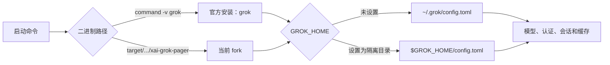

# Grok Fork：从源码构建到配置加载

本文说明如何在本机已经安装官方 Grok 的情况下，构建并运行当前仓库的 fork，隔离测试数据，定义 BYOK 模型，以及判断某一份配置究竟有没有被当前进程加载。

本文以仓库当前实现为准。最重要的结论是：

- 官方安装的命令通常叫 `grok`；源码构建产物叫 `xai-grok-pager`，二者可以并存。
- 主配置文件始终是 `$GROK_HOME/config.toml`；未设置 `GROK_HOME` 时，它等于 `~/.grok/config.toml`。
- `[models]` 和 `[model.*]` 属于用户/受管配置层，不从仓库内的 `.grok/config.toml` 加载。
- 仓库内的 `.grok/config.toml` 由特定子系统按需读取，目前用于 `[mcp_servers]`、`[plugins]` 和 `[permission]`，并不是完整的用户配置覆盖层。
- 验证 fork 时推荐同时固定“二进制绝对路径”和 `GROK_HOME`，避免误用官方二进制或混用官方会话、认证和缓存。

## 1. 先理解两个相互独立的选择

一次 Grok 启动包含两个独立选择：运行哪个二进制，以及该进程使用哪个 Grok home。



仅仅修改配置不能证明运行的是 fork；仅仅使用 fork 二进制，也不能证明它读的是预期配置。验证时需要同时检查两者。

## 2. 构建要求

在仓库根目录执行以下操作。

### 2.1 Rust 工具链

仓库通过 `rust-toolchain.toml` 固定 Rust 工具链。安装 `rustup` 后，第一次运行 Cargo 时会自动安装对应版本。

```bash
rustup --version
cargo --version
```

### 2.2 DotSlash 和 protoc

仓库中的 hermetic 工具通过 DotSlash 启动，尤其是 `bin/protoc`。

```bash
cargo install dotslash
/usr/bin/env dotslash --help
```

proto 构建会优先使用 `bin/protoc`，也可以回退到 `PATH` 中的 `protoc` 或 `$PROTOC`。

## 3. 构建 fork

composition-root Cargo package 是 `xai-grok-pager-bin`，但生成的二进制名是 `xai-grok-pager`。

### 3.1 快速类型检查

```bash
cargo check -p xai-grok-pager-bin
```

这一步检查能否编译，但不会生成可直接运行的最终二进制。

### 3.2 Debug 构建

```bash
cargo build -p xai-grok-pager-bin
```

产物位置：

```text
target/debug/xai-grok-pager
```

Debug 构建适合本地开发和验证改造。

### 3.3 Release 构建

```bash
cargo build -p xai-grok-pager-bin --release
```

产物位置：

```text
target/release/xai-grok-pager
```

Release 构建更接近实际分发行为，但编译时间通常更长。

### 3.4 构建并直接启动

```bash
cargo run -p xai-grok-pager-bin
```

给 Grok 传参时，在 Cargo 参数和应用参数之间加 `--`：

```bash
cargo run -p xai-grok-pager-bin -- --version
```

稳定复现问题时，更推荐先 `cargo build`，然后直接运行产物绝对路径。这样能明确知道本次测试使用的是哪一个二进制。

## 4. 与官方 Grok 并存

先记录官方安装的位置和版本：

```bash
type -a grok
OFFICIAL_GROK="$(command -v grok)"
"$OFFICIAL_GROK" --version
ls -l "$OFFICIAL_GROK"
```

再记录 fork 路径：

```bash
REPO_ROOT="$(git rev-parse --show-toplevel)"
FORK_GROK="$REPO_ROOT/target/debug/xai-grok-pager"
test -x "$FORK_GROK"
"$FORK_GROK" --version
```

不要为了测试而把 fork 复制到官方安装位置，也不要把它重命名后覆盖 `~/.grok/bin/grok`。直接使用 `$FORK_GROK` 即可保证官方安装不受影响。

如果需要日常使用一个短命令，可以在 shell 配置中定义函数：

```bash
export GROK_FORK_REPO="/absolute/path/to/grok-build"

grok-fork() {
  GROK_HOME="$HOME/.grok-fork" \
    "$GROK_FORK_REPO/target/debug/xai-grok-pager" "$@"
}
```

修改路径后重新加载 shell 配置，再执行：

```bash
grok-fork --version
```

## 5. 选择是否隔离 Grok home

### 5.1 复用官方用户目录

不设置 `GROK_HOME`：

```bash
"$FORK_GROK" --version
"$FORK_GROK" models
```

此时 fork 默认读取：

```text
~/.grok/config.toml
```

这可以直接复用已经定义好的模型和登录状态，但 fork 与官方版本也会共享认证、会话、缓存及其他运行数据。它适合快速确认，不适合作为严格的回归测试环境。

### 5.2 使用独立目录（推荐）

```bash
FORK_GROK_HOME="$HOME/.grok-fork"
mkdir -p "$FORK_GROK_HOME"
chmod 700 "$FORK_GROK_HOME"

GROK_HOME="$FORK_GROK_HOME" "$FORK_GROK" --version
```

此时主配置文件变为：

```text
$HOME/.grok-fork/config.toml
```

可使用编辑器创建它：

```bash
"${EDITOR:-vi}" "$FORK_GROK_HOME/config.toml"
chmod 600 "$FORK_GROK_HOME/config.toml"
```

`GROK_HOME` 不只改变 `config.toml` 的位置，还会隔离认证、会话、缓存、插件和其他 Grok 运行数据。因此，隔离目录第一次运行时可能需要重新登录。若模型通过 `env_key` 使用自己的 API key，则不必依赖官方 Grok 的登录文件。

不要把 `GROK_HOME` 只用于部分命令。以下命令应始终使用相同前缀：

```bash
GROK_HOME="$FORK_GROK_HOME" "$FORK_GROK" inspect
GROK_HOME="$FORK_GROK_HOME" "$FORK_GROK" models
GROK_HOME="$FORK_GROK_HOME" "$FORK_GROK"
```

## 6. 用户配置如何加载

### 6.1 `$GROK_HOME` 的解析

配置目录按以下规则确定：

1. 设置了 `GROK_HOME`：使用该目录。
2. 未设置 `GROK_HOME`：使用 `~/.grok`。

用户主配置的文件名固定为 `config.toml`，所以默认路径是 `~/.grok/config.toml`，隔离测试路径则是 `$GROK_HOME/config.toml`。

### 6.2 TOML 配置层

基础配置由多层 TOML 深度合并。下表从低优先级到高优先级列出主要磁盘层：

| 顺序 | 配置层 | 常见路径 |
|---:|---|---|
| 1 | 系统 managed | `/etc/grok/managed_config.toml` |
| 2 | 用户 managed | `$GROK_HOME/managed_config.toml` |
| 3 | 用户配置 | `$GROK_HOME/config.toml` |
| 4 | 用户 requirements | `$GROK_HOME/requirements.toml` |
| 5 | 系统 requirements | `/etc/grok/requirements.toml` |
| 6 | MDM requirements | macOS 管理策略提供的内存层 |

组织部署还可能应用 campaign/remote patch；应用后 requirements 层会再次覆盖，以保证管理员约束保持最高权限。

环境变量和 CLI 参数由各自的运行时解析器处理。并非每个字段都存在相同的环境变量或 CLI 覆盖项，因此不要把“CLI > 环境变量 > TOML”当作所有字段都适用的统一规则。

### 6.3 项目 `.grok/config.toml` 不是完整覆盖层

仓库内可以存在以下文件：

```text
<repo-root>/.grok/config.toml
<repo-root>/<subdir>/.grok/config.toml
```

Grok 从 git 仓库根目录走到当前目录，越靠近当前目录优先级越高。但是这些项目文件不会整体合并进前面的用户配置层，而是由特定子系统读取。

当前支持的项目级 section 是：

- `[mcp_servers]`
- `[plugins]`
- `[permission]`

项目配置还受 folder trust 限制。未信任的仓库不能通过项目配置启动 MCP、加载插件路径或注入权限规则。

以下配置即使写进 `<repo>/.grok/config.toml`，也不会成为模型目录的一部分：

```toml
[model.my-model]
model = "provider-model-id"
```

模型定义应写到：

```text
$GROK_HOME/config.toml
```

默认情况下它就是：

```text
~/.grok/config.toml
```

这并不表示 Grok 不支持自定义模型，只表示模型配置属于用户/受管层，而不是仓库级共享层。

## 7. 配置 BYOK 模型与图片理解

下面是一份隔离测试配置模板。示例 URL 和模型 ID 必须替换为实际供应商值。

```toml
[cli]
auto_update = false

[features]
remote_fetch = false

[models]
default = "text-main"
image_description = "vision-helper"

[model.text-main]
model = "provider-text-model-id"
name = "Text Main"
base_url = "https://text-provider.example/v1"
env_key = "TEXT_MODEL_API_KEY"
api_backend = "chat_completions"
context_window = 128000
accepts_images = false

[model.vision-helper]
model = "provider-vision-model-id"
name = "Vision Helper"
base_url = "https://vision-provider.example/v1"
env_key = "VISION_MODEL_API_KEY"
api_backend = "chat_completions"
context_window = 128000
accepts_images = true
```

在启动 fork 的同一个 shell 中提供凭据：

```bash
export TEXT_MODEL_API_KEY="..."
export VISION_MODEL_API_KEY="..."
```

建议使用 `env_key`，不要把真实 key 直接写进可提交的 TOML。

关键字段含义：

| 字段 | 含义 |
|---|---|
| `[models].default` | 新会话默认主模型 |
| `[models].image_description` | 给纯文本主模型描述图片的辅助视觉模型 |
| `[model.<name>]` | `<name>` 是模型选择器和配置目录中的 key |
| `model` | 实际发送给供应商 API 的模型 ID；省略时使用 section key |
| `base_url` | 模型的 OpenAI/Anthropic 兼容 API 根地址 |
| `api_backend` | `chat_completions`、`responses` 或 `messages` |
| `env_key` | 从哪个环境变量读取该模型的凭据 |
| `accepts_images` | `true` 直接传图；`false` 先调用 `image_description` 辅助模型 |

`accepts_images` 未配置时默认是 `true`，用于保持历史行为。纯文本主模型必须显式配置为 `false`，并给 `image_description` 指定一个具有独立凭据的视觉模型。

当前图片理解改造的预期行为是：

- 视觉主模型：图片结构化内容直接进入主模型请求。
- 纯文本主模型：先持久化图片并调用辅助视觉模型，主模型只接收 `<image_description>` 和 `<image_files>` 文本。
- 辅助模型失败：终止本轮，不静默丢图。
- 会话历史已经包含用户图片时切换到纯文本模型：下一次采样以 `TEXT_MODEL_HISTORY_CONTAINS_IMAGES` 阻止；切回视觉模型或新建会话。

更完整的设计背景见 [BYOK 图片理解研究](../research/byok-image-understanding.md)。

## 8. 验证实际加载结果

以下示例继续使用前面定义的 `FORK_GROK` 和 `FORK_GROK_HOME`。

### 8.1 确认二进制

```bash
"$OFFICIAL_GROK" --version
"$FORK_GROK" --version
```

版本字符串可能相近，因此决定性证据是启动命令中的绝对路径。fork 应来自：

```text
<repo-root>/target/debug/xai-grok-pager
```

或：

```text
<repo-root>/target/release/xai-grok-pager
```

### 8.2 确认配置来源

```bash
GROK_HOME="$FORK_GROK_HOME" "$FORK_GROK" inspect
```

重点查看 `Config Sources`，用户层路径应指向：

```text
$FORK_GROK_HOME/config.toml
```

机器可读形式：

```bash
GROK_HOME="$FORK_GROK_HOME" "$FORK_GROK" inspect --json \
  | jq '.configSources.layers'
```

检查配置解析警告：

```bash
GROK_HOME="$FORK_GROK_HOME" "$FORK_GROK" inspect --json \
  | jq '.configWarnings // []'
```

`jq` 不是 Grok 必需依赖；未安装时直接查看完整 JSON 即可。

### 8.3 确认模型目录和默认模型

```bash
GROK_HOME="$FORK_GROK_HOME" "$FORK_GROK" models
```

输出中应同时出现 `text-main`、`vision-helper`，默认模型应为 `text-main`。如果模型配置存在但凭据不可用，可用模型列表可能会过滤它，因此还要确认 `env_key` 指向的环境变量已经设置且非空。

有效配置中的模型目录优先级为：

1. 有效 TOML 中的 `[model.*]` 覆盖。
2. 远程 `/v1/models` 预取目录。
3. 内置默认模型。

### 8.4 先做纯文本连通性测试

```bash
GROK_HOME="$FORK_GROK_HOME" \
  "$FORK_GROK" -p "只回复 CONFIG_OK" -m text-main
```

这一步通过后，再进入 TUI 测试图片。这样可以把“模型/凭据配置失败”和“图片路由失败”分开定位。

### 8.5 图片路由验收

至少验证以下三条路径：

1. `text-main` 发送图片：辅助视觉请求成功，主模型能根据图片回答。
2. `vision-helper` 故意配置为不可用：本轮明确报错，主模型不应继续收到一个缺图请求。
3. 切到 `accepts_images = true` 的视觉主模型发送图片：不应经过辅助描述路径。

如果可以抓取测试供应商或本地 mock server 的请求体，纯文本主模型的主请求中不应出现用户 `image_url`；辅助模型请求中应包含图片。

## 9. 常见误判

### 9.1 改了配置，但运行的仍是官方 Grok

现象：fork 新字段似乎无效。

检查：

```bash
command -v grok
type -a grok
```

解决：使用 `target/debug/xai-grok-pager` 或 `target/release/xai-grok-pager` 的绝对路径。

### 9.2 运行的是 fork，但读了官方配置

现象：旧模型、旧会话或旧登录状态仍然出现。

原因：没有设置 `GROK_HOME`，fork 和官方 Grok 都读取 `~/.grok`。

解决：给每一次 fork 命令加同一个 `GROK_HOME="$FORK_GROK_HOME"` 前缀。

### 9.3 把模型写在仓库 `.grok/config.toml`

现象：TOML 文件存在，`inspect` 也可能列出这个项目配置文件，但 `grok models` 没有该模型。

原因：`inspect` 展示项目配置来源，不代表每个 section 都会合并到全局配置。模型加载器不消费项目级 `[model.*]`。

解决：移动到 `$GROK_HOME/config.toml`。

### 9.4 隔离后要求重新登录

原因：认证文件也位于 Grok home。隔离 `GROK_HOME` 会同时隔离认证状态。

解决：给 BYOK 模型配置独立 `env_key`，或在隔离环境中重新执行登录。不要无意间共享、覆盖或提交 `auth.json`。

### 9.5 修改 TOML 后仍像旧配置

先退出所有相关 fork 进程，再使用相同环境重新运行：

```bash
GROK_HOME="$FORK_GROK_HOME" "$FORK_GROK" inspect
GROK_HOME="$FORK_GROK_HOME" "$FORK_GROK" models
```

同时检查是否有旧的 leader/session 进程以及配置解析警告。隔离 `GROK_HOME` 也能避免 fork 连接到官方环境留下的运行状态。

## 10. 清理 `target` 中间产物

优先使用 Cargo 自带的精确清理命令，先预览再执行。

只查看将要清理的 `xai-grok-pager-bin` 产物：

```bash
cargo clean -p xai-grok-pager-bin --dry-run
```

清理该 package 的构建产物：

```bash
cargo clean -p xai-grok-pager-bin
```

只清理该 package 的 release 产物：

```bash
cargo clean -p xai-grok-pager-bin --release
```

查看整个 `target` 大小：

```bash
du -sh target
```

只有确实要让整个 workspace 从零重编译时，才清理全部 Cargo 产物：

```bash
cargo clean --dry-run
cargo clean
```

完整清理会删除可重新生成的编译缓存，不影响源码，但下一次构建会明显更慢。

## 11. 最小验收清单

- [ ] `cargo check -p xai-grok-pager-bin` 成功。
- [ ] `cargo build -p xai-grok-pager-bin` 成功。
- [ ] fork 通过 `target/debug/xai-grok-pager` 的绝对路径启动。
- [ ] 官方 `grok` 路径和文件没有被覆盖。
- [ ] fork 使用独立且固定的 `GROK_HOME`。
- [ ] `inspect` 显示预期的 `$GROK_HOME/config.toml`。
- [ ] `models` 显示主模型、辅助视觉模型和正确的默认模型。
- [ ] 纯文本主模型的普通文本请求成功。
- [ ] 纯文本主模型发送图片时经过辅助视觉模型，主请求没有用户图片 part。
- [ ] 视觉主模型仍能直接接收图片。
- [ ] 辅助视觉模型失败时，本轮被明确终止。

## 12. 实现依据

- [根 README：源码构建](../../README.md#building-from-source)
- [`xai-grok-pager-bin` Cargo 清单](../../crates/codegen/xai-grok-pager-bin/Cargo.toml)
- [`GROK_HOME` 路径解析](../../crates/codegen/xai-grok-config/src/paths.rs)
- [用户配置与配置层加载](../../crates/codegen/xai-grok-config/src/loader.rs)
- [项目配置文件发现](../../crates/codegen/xai-grok-workspace/src/project_config.rs)
- [项目 MCP 配置加载](../../crates/codegen/xai-grok-shell/src/util/config/mcp.rs)
- [配置总览](../../crates/codegen/xai-grok-pager/docs/user-guide/05-configuration.md)
- [自定义模型说明](../../crates/codegen/xai-grok-pager/docs/user-guide/11-custom-models.md)
