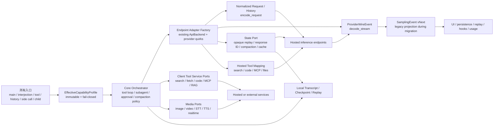
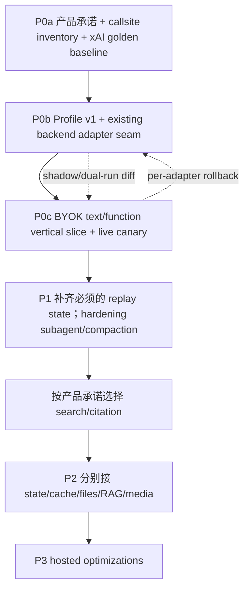

# Grok 官方能力依赖与第三方模型定制边界调研

> 面向：grok-build 的 BYOK / 多模型接入决策  
> 结论有效期：2026-08-12；仓库基线：`66a92e5cdd4ca16c2221ac19c1dc9f35f5d30318`  
> 说明：本文讨论“现有 grok-build 二进制能否仅靠配置获得等价行为”，不只讨论供应商接口是否能返回文本。

## 0. 执行摘要

结论先说：**只有当目标 endpoint 完整实现并实际遵守现有 backend 的 text、sampling 与 tool contract 时，基础文本和被该 contract 覆盖的参数才可能纯配置接入；大部分 Grok 高阶能力不能仅靠修改模型名、Base URL、API Key 和少量参数获得。** 原因不只是 API 字段不同，还包括服务端数据与执行环境、流式事件、引用和回放、会话状态、错误/计费语义及客户端编排。[来源 3][来源 4][来源 11-21]

用户关心的四个方向，判断如下：

- **网络搜索：分层判断。** 若第三方 endpoint 完整复现现有 Responses `web_search` request/stream contract，当前代码可能仅靠配置调用其 native search，但结构化 citation/replay 仍会降级；不匹配的 hosted search 需要 provider adapter，没有 hosted search 时需要外部搜索服务与本地编排。无论哪条路径，都不能承诺 xAI/X 的索引、排序、实时性和引用语义完全一致。[来源 4-6][来源 11-15][来源 22]
- **子 Agent：本地能力不锁定 Grok，官方多 Agent 另算。** grok-build 的 task tool、child runner、队列、并发、取消、进度、usage 与 spawn/finish replay 都在客户端；progress 本身是 transient。只要第三方模型可靠完成工具调用，本地 subagent 可复用；若 tool-call IDs/delta/finish/reasoning 不同，需要 adapter。xAI `grok-4.20-multi-agent` 默认只暴露 leader 输出与 tool calls，也可返回供续轮使用的不透明 encrypted subagent state；它仍不等价于本地 child session/worktree/artifact 语义。[来源 7][来源 17]
- **自动压缩上下文：本地版本大体可移植，原生版本需适配。** Shell 已有真实的 pre-sampling threshold、tool-output overflow、error recovery、history rebuild 和 checkpoint 流程；它可通过现有 sampler 调第三方模型生成摘要。xAI/Anthropic/OpenAI/Gemini 的原生 compaction/state 机制各不相同，若要使用 opaque block、server conversation 或 provider usage 语义，则需要 adapter，部分还要改 replay/persistence core。[来源 8][来源 16][来源 22-23][来源 26][来源 30-31]
- **生图：需要 provider tool adapter。** 最近完成的是“图片输入不兼容时转描述”的能力策略，不等于生图兼容。当前 image/video generation 直接使用 xAI endpoint、payload、`b64_json`/polling/S3 约定；第三方生成 API 必须单独接入。[来源 1][来源 2][来源 9][来源 21]

比这四项更容易被低估的定制点是：**SSE/事件翻译、reasoning state、tool-call 生命周期、结构化输出保证、server state/prompt cache/files、MCP 协议、auth/retry/cancel、usage/cost、retention/residency 和 model lifecycle**。[来源 4][来源 7][来源 10][来源 22-38]

推荐不要继续用一组 `supports_*` 布尔值堆兼容逻辑，而是建立：

1. surface-aware capability registry；
2. provider request/stream/state/tool/media adapters；
3. provider-neutral event envelope；
4. 覆盖所有 ingress、history、side-call、subagent 和失败路径的 contract suite。

## 1. 判定口径

### 1.1 什么叫“纯配置”

本文采用严格口径：**不修改 stock binary，不增加会改写请求/响应的 gateway，只设置已有配置后，就能让完整目标场景通过。** 已有配置包括 model、Base URL、API key、auth scheme、headers/query params、sampling parameters、现有 `api_backend` 与 capability metadata。[来源 3]

下列情况不算纯配置：

- 反向代理将一种协议翻译成另一种协议；
- 新增 provider-specific request/stream parser；
- 新增搜索、生图、文件、MCP 或 state service client；
- 修改 session history、tool loop、replay、UI event 或权限策略；
- 请求返回 2xx，但目标字段被静默忽略。

Anthropic 官方的 OpenAI compatibility 是很清楚的反例：它定位为测试/比较用途，`strict`、audio、prompt cache、`response_format`、`reasoning_effort` 等字段会被忽略或改变，许多不支持字段不报错而是静默处理。[来源 25]

### 1.2 判定字段

单一“配置 / 定制 / 核心 / 锁定”分类会混淆实施位置与结果质量。本文固定以“**对 Grok/xAI 当前参考行为的 parity**”为等价度比较对象；另行注明能否忠实实现目标 provider 自己的 native contract。各项能力同时记录：

| 字段 | 取值 | 回答的问题 |
|---|---|---|
| 实施位置 | config / provider adapter / core / external-hosted service，可多选 | 改哪里 |
| 实现方式 | provider-native / client-native / existing emulation / new emulation，可多选 | 由 provider、客户端原生能力还是模拟实现 |
| Grok parity | exact / functional / degraded / unavailable / unverified | 相对 Grok/xAI 参考行为多接近 |
| Native fidelity | native-verified / native-unverified / emulated-functional / partial-emulation / not-applicable | 对目标 provider 自身 contract 的实现质量；纯客户端能力记 not-applicable |
| 责任边界 | control / execution / state 分别属于 client、provider 或 hybrid | 谁决策、执行、保存状态 |
| 依赖标签 | none / hosted-replaceable / xAI-strong | 能否迁移或替代 |
| 证据范围 | provider × endpoint × model × region × auth × version × valid-at | 本结论对什么 surface 有效 |

因此，一项能力可以是“config + degraded”，也可以是“adapter + functional”。没有 live contract test 时，本文不使用“exact”认证。“官方锁定”只描述依赖，不与实施位置并列。[来源 25][来源 34-38]

### 1.3 配置项不是能力证明

`api_backend`、`supports_backend_search`、`accepts_images`、`reasoning`、`stream_tool_calls`、`context_window` 等字段只是声明。只有在请求构造、所有入口、事件解析、history/replay 和失败路径中实际消费后，才构成能力。[来源 2-4]

## 2. 最近图片兼容改动提供的基线

Commit `f5bbd4699de92e3d723a927d1e3ceaadd5d0b6c1` 是本次判断最重要的历史证据。变更之前，图片描述 helper 的配置已经存在，但普通非 Cursor TUI 路径受 `is_cursor_harness()` 分支影响，会直接持久化并发送 `image_url`；所以单独改配置无法让 text-only provider 安全工作。[来源 1]

修复不是只加一个字段，而是建立了完整能力策略：

- 从 model catalog 的 `accepts_images` 推导 `PassThrough` / `Transcribe`；
- 用户当前输入统一 normalize/extract；
- interjection 走同一策略；
- tool-result inline/extracted images 受策略约束；
- text-only model 在历史仍含结构化图片时结构化拒绝，而不是静默改写持久历史；
- helper temperature 在配置完成阶段处理，保留 provider 参数差异。[来源 2]

这给其他能力提供了可复用模板：

```text
能力声明 → 单一策略对象 → 所有入口消费 → provider wire transform
        → history/replay safety → 正向/负向 contract tests
```

## 3. 总体能力矩阵

> `条件配置` 表示：目标 surface 完整复现仓库已支持的某个 backend contract，且通过全场景测试。表中 parity 全部相对 Grok/xAI 参考行为；“native fidelity”只说明能否忠实实现目标 provider 自己的 contract。表是 capability-family 的架构摘要，任何上线结论仍须落到 `provider × endpoint × model × region × auth × version`。相对量级 S/M/L/XL 不是工期承诺。决策列中的 P0/P1/P2/P3 分别表示接入基线、Agent 正确性、独立 provider service、可选 hosted 优化；`不承诺` 表示不进入实现路线。

| 能力 / surface | 纯配置？ | 实施位置与方式 | Grok parity / native fidelity | 责任边界（control / execution / state） | 依赖标签 | 量级 | 优先级 / 风险 / 迁移建议 | 结论 |
|---|---|---|---|---|---|---:|---|---|
| 基础 text chat / honored sampling | 条件配置 | config；provider-native | functional / native-unverified | client / provider / hybrid | none | S | P0 / 高：协议静默漂移 / 固化 contract profile 与正负测试 | chunk、finish、usage 与字段语义都匹配才成立 [来源 3-4] |
| 图片输入到 vision model | 条件配置 | config；provider-native + client-native policy | functional / native-unverified | client / provider / hybrid | none | S | P0 / 高：旁路泄漏图片 / 保持全 ingress capability policy | 所有 ingress 仍须过 capability policy [来源 1-2] |
| text-only 图片转描述 | helper contract 兼容时是 | config + existing core emulation | degraded / emulated-functional | client / provider / client | hosted-replaceable | S | P0 / 中：描述丢信息或 helper 失败 / 保留降级标签与失败策略 | 描述替代原图，不是原生 vision [来源 2] |
| Responses-compatible Web Search | 条件配置 | config；provider-native hosted execution | degraded / native-unverified | client / provider / hybrid | hosted-replaceable | S-M | P1 / 高：引用 metadata 丢失 / 先隔离开关，再补 citation adapter | 可调用搜索；当前 citation normalization 丢 metadata [来源 4-5][来源 22] |
| 非兼容 hosted Web Search | 否 | provider adapter；provider-native | functional / native-unverified | hybrid / provider / hybrid | hosted-replaceable | M-L | P1 / 高：事件、state、计费错配 / 按 provider 独立适配 | 需映射事件、引用、state、usage [来源 11][来源 27][来源 29] |
| 调用 xAI X Search | 仅继续使用 xAI surface 时是 | config + xAI hosted service；provider-native | unverified / native-unverified | provider / provider / provider | xAI-strong | S | P1 / 高：持续 xAI 锁定 / 把搜索与主模型配置隔离 | X 专属索引和 filters；未做 live parity 认证 [来源 12] |
| 第三方 X-like social search | 否 | external/hosted replacement + adapter；new emulation | degraded / partial-emulation | hybrid / provider / hybrid | hosted-replaceable | L-XL | P2 / 高：质量与实时性不同 / 作为明确标注的降级替代 | 可替代社交内容发现，但索引、排序与实时性不同 [来源 12] |
| 第三方达到 xAI X Search exact parity | 否 | 无可实现的第三方配置或 adapter 路径 | unavailable / not-applicable | provider / provider / provider | xAI-strong | XL | 不承诺 / 极高：专属索引不可复制 / 不进入第三方实现路线 | xAI 专属 X 索引不可由第三方 surface 精确复现 [来源 12] |
| 外部 Web Search | 否 | external service + adapter/core；new emulation | functional / emulated-functional | client / hybrid / client | hosted-replaceable | M-L | P1 / 高：排序与引用不可比 / 建 provider-neutral search/citation core | 需统一 result/citation/event；`web_fetch` 不是 search [来源 6] |
| 本地 subagent | 条件配置 | existing core；client-native；必要时 adapter | functional / not-applicable | client / hybrid / client | none | S-M | P1 / 高：tool/state 生命周期错位 / 复用 core 并做全生命周期测试 | 取决于 tool-call 协议、state replay 与可靠性 [来源 7] |
| xAI server multi-agent（调用自身能力） | 条件配置，Responses contract 匹配时 | xAI hosted model；provider-native | unverified / native-unverified | provider / provider / provider | xAI-strong | S-M | P3 / 高：opaque child state / 仅作可选 xAI 优化 | 默认只返回 leader surface，可附 opaque encrypted state [来源 17] |
| 用 hosted swarm 替代本地 child lifecycle | 否 | core redesign 或 emulation | unavailable / partial-emulation | hybrid / provider / hybrid | xAI-strong | XL | 不承诺 / 极高：本地 identity 与副作用丢失 / 不作为替代方案 | 无本地 child identity、artifact/worktree 语义 [来源 7][来源 17] |
| 本地自动摘要压缩（标准 turn） | 条件配置 | existing core + sampler；client-native | functional / not-applicable | client / hybrid / client | none | S-M | P1 / 高：history 损坏 / 先加固 replay、checkpoint 与 child 例外 | production path 已存在；budgeted child 有例外 [来源 8] |
| xAI opaque compaction | 否 | state adapter + 可能的 core change；provider-native | functional / native-unverified | client / provider / hybrid | xAI-strong | L | P2 / 高：opaque state 不可迁移 / 建独立 state adapter | 当前 Shell 未调用 `/responses/compact` [来源 8][来源 16] |
| 其他 provider-native auto compaction | 否 | provider adapter + core state；provider-native | functional / native-unverified | hybrid / provider / hybrid | hosted-replaceable | L | P2 / 高：触发与 replay 语义不同 / 基线稳定后逐 provider 接入 | OpenAI/Anthropic/Gemini Live contract 不同 [来源 22-23][来源 26][来源 30] |
| Image / video generation | 否 | provider tool/media adapter；provider-native | functional / native-unverified | client / provider / hybrid | hosted-replaceable | M-L | P2 / 高：endpoint 与异步生命周期不同 / image、video 分 adapter | 当前实现 xAI-coupled；endpoint、polling、storage、output shape 专用 [来源 9][来源 21][来源 35] |
| Realtime Voice | 否 | realtime adapter + core events；provider-native | functional / native-unverified | hybrid / provider / hybrid | hosted-replaceable | XL | P2 / 极高：双工事件与取消复杂 / 独立 realtime port，不阻塞 BYOK text | 对话、VAD、function/MCP、audio events [来源 21] |
| 第三方 TTS / STT | 否 | provider media adapter；provider-native | functional / native-unverified | client / provider / hybrid | hosted-replaceable | M-L | P2 / 高：协议与音频格式分裂 / TTS、STT 分别接入 | 已有 xAI STT dictation，但无通用 audio conversation layer [来源 9][来源 21] |
| Provider-hosted code sandbox | 否 | provider adapter + request/tool-schema extension；provider-native | functional / native-unverified | hybrid / provider / provider | hosted-replaceable | M-L | P2 / 高：安全与事件 contract 不同 / 扩展 request schema 后逐 provider 验证 | 当前只有 latent Responses `code_interpreter` 事件处理，没有可配置的 hosted-sandbox 请求路径 [来源 4][来源 14][来源 18][来源 22] |
| 外部 sandbox 作为 client tool | 否 | external service + core tool loop；new emulation | degraded / partial-emulation | client / hybrid / client | hosted-replaceable | L-XL | P2 / 极高：隔离与网络策略自担 / 仅作受控 client tool | 可提供代码执行，但不复现 hosted sandbox 的隔离、状态与计费语义 [来源 18][来源 37] |
| Files / Collections / RAG | 否 | state/tool adapter + provider service；provider-native | functional / native-unverified | hybrid / provider / hybrid | hosted-replaceable | L | P2 / 高：retention 与 citation URI 锁定 / 独立 state/RAG adapter | IDs、TTL、retrieval、citation URI 与治理 [来源 19] |
| Remote MCP hosted connector | 否 | provider adapter + core approval；provider-native | functional / native-unverified | hybrid / provider / hybrid | hosted-replaceable | L | P2 / 高：OAuth、approval、事件差异 / 先统一安全策略再接 provider | transport、approval、OAuth、event lifecycle 不同 [来源 20][来源 28] |
| 普通 function tools | 条件配置 | config 或 adapter；provider-native request + client-native execution | functional / native-unverified | client / hybrid / client | none | S-M | P0 / 极高：ID/delta/replay 影响正确性 / 作为首条 BYOK vertical slice | schema、parallel、delta、ID/replay 必须实测 [来源 4][来源 14][来源 25] |
| 可见 reasoning effort/output | 条件配置 | config 或 provider adapter；provider-native | functional / native-unverified | hybrid / provider / hybrid | hosted-replaceable | S-M | P0/P1 / 高：参数被忽略 / capability profile 显式映射 | 参数与 display semantics 不通用 [来源 4][来源 25][来源 33] |
| signed/encrypted reasoning/tool state | 否 | provider state adapter；provider-native | functional / native-unverified | client / provider / hybrid | hosted-replaceable | M-L | P0/P1 / 极高：丢失会破坏多轮正确性 / 必须原样 round-trip | 多轮原样回放可能是 correctness 前提 [来源 15][来源 17][来源 27][来源 33] |
| Structured output：native grammar | 条件配置/adapter | config 或 adapter；provider-native | functional / native-unverified | client / provider / hybrid | hosted-replaceable | S-M | P1 / 高：schema subset 静默降级 / 做 grammar/tool 组合测试 | schema subset 与 tool combination 需实测 [来源 14][来源 25][来源 31] |
| Structured output：本地 tool 模拟 | 条件配置 | existing core emulation | degraded / emulated-functional | client / hybrid / client | none | S | P1 / 中：验证重试仍非 grammar / 保留为明确降级 fallback | tool + validate + retry，保证弱于 native grammar [来源 4][来源 25] |
| Prompt cache：automatic | 条件配置 | provider policy；provider-native | functional / native-unverified | provider / provider / provider | hosted-replaceable | S | P2 / 中：TTL 与命中不可控 / 先观测 usage，不作为正确性依赖 | 自动 prefix cache 无需 wire key，但 usage/TTL 不同 [来源 33] |
| Prompt cache：explicit controls | 否 | existing partial support + provider adapter；provider-native | functional / native-unverified | hybrid / provider / provider | hosted-replaceable | M | P2 / 高：失效与计费语义不同 / 按 backend 建 cache policy | Responses key 与 Messages cache-control 已部分实现 [来源 3-4][来源 15][来源 25] |
| Stored conversation / response chain | 否 | state adapter + persistence core；provider-native | functional / native-unverified | hybrid / provider / hybrid | hosted-replaceable | L | P2 / 高：retention、删除与 replay 锁定 / 独立 state adapter | previous IDs、retention、delete、ZDR 各异 [来源 15-16][来源 22-24] |
| SSE / error / usage | 条件配置仅限完整同 contract | config（同 contract）或 provider adapter（异 contract）；provider-native | functional / native-unverified | hybrid / provider / hybrid | hosted-replaceable | S-M | P0 / 极高：错误重试与 usage 失真 / 先建 normalized stream contract | 只能忠实保留 provider 暴露的字段 [来源 4][来源 10][来源 37-38] |
| Cost | 否（provider 已直接返回者除外） | adapter + pricing/ledger service；provider-native usage + client-native ledger | unverified / native-unverified | hybrid / provider / hybrid | hosted-replaceable | M | P1/P2 / 高：重试与 hosted charge 漏算 / 建独立 per-attempt ledger | retry、hosted tools、media、currency/version 需独立核算 [来源 4][来源 10] |
| 静态 key / basic timeout | 条件配置 | config；provider-native auth contract + client-native plumbing | functional / native-unverified | client / provider / client | none | S | P0 / 中：secret/header 泄漏 / 只认证受支持的静态 auth profile | 只覆盖 Bearer/X-API-Key 子集 [来源 10] |
| Auth refresh / retry / cancel / discovery | 否 | adapter + core + ops policy；provider-native integration + client-native policy | functional / native-unverified | hybrid / hybrid / hybrid | hosted-replaceable | M-L | P1 / 极高：重复计费、凭据与取消失真 / 建 provider ops contract gate | 需按 provider 行为验证 [来源 10][来源 24-25][来源 28] |

## 4. 网络搜索与引用

### 4.1 当前实现为什么不是通用搜索层

当前有两条不同路径，不能合并判断：

1. `WebSearchClient` 是一个**客户端 function tool**，有独立的 `WebSearchConfig {api_key, base_url, model}`；它向配置的 `{base_url}/responses` 调用 `web_search`，再把文本和引用 URL 交给主模型。因此主文本模型与搜索模型可以分开配置，但搜索调用本身仍依赖 Responses/xAI shape。[来源 5]
2. `backend_search` 会把 hosted `web_search` / `x_search` 直接注入主 sampler；provider 负责执行，UI/replay 识别固定 tool event 与 output item。只会普通 Chat Completions 的 endpoint 不会凭空产生这些事件。[来源 4-5]

xAI response-level `citations` 表示工具执行遇到的完整 URL 集合，而 inline annotations 才是文本位置引用。当前常规 `WebSearchOutput` 只从 `output_text.annotations` 提取并去重 URL，既没有保留 response-level encountered sources，也没有 title、snippet、rank、span 或 raw metadata；另有 `search_with_titles()` 兼容路径能取 `(title, url)`，但没有进入常规持久化输出。[来源 5][来源 13]

`web_fetch` 能抓取一个已知的公开 URL，并返回 markdown、final URL、status、MIME type 和 byte count；它不能发现来源、排序、生成 grounding supports 或引用映射。因此“保留 web_fetch”不等于“兼容网络搜索”。[来源 6]

### 4.2 哪些部分真正依赖 xAI 官方能力

- xAI 的实时 Web/X 索引和排序；
- 服务端自动执行的搜索、页面浏览与多轮 tool loop；
- X handle/date/image/video-specific filters；
- Responses 中的 tool lifecycle、citations、annotations 与 usage；
- 与 Collections、code execution、MCP 混合执行的服务端 loop。[来源 11-15]

这些能力可以被别的 hosted provider 替代，但不保证由 `base_url` 自动获得。一个完整复现现有 Responses `web_search` request/event contract 的 endpoint（OpenAI 是当前关键候选）可能只靠配置就能**调用其自身搜索**；不过仓库当前会丢掉结构化 annotations，所以引用与回放仍是降级的。Anthropic 与 Gemini 则分别返回 encrypted replay blocks 或 `groundingMetadata`，需要 provider adapter。[来源 22][来源 27][来源 29]

### 4.3 推荐的最小通用模型

```text
SearchResult      { query, title, url, snippet, provider, rank, metadata }
EncounteredSource { url, title, provider_metadata }
Citation          { url, title, span_or_annotation, source_id }
SearchEvent       { started, progress, completed(results, citations), error }
FetchResult  { requested_url, final_url, content, content_type, status, artifact_ref }
```

其中 `provider_ext` 必须保留原始 grounding/citation payload，避免最小公共字段吞掉 provider 的可追溯信息。[来源 5][来源 27][来源 29][来源 37]

### 4.4 可选策略

| 策略 | 改造 | 优点 | 代价/降级 |
|---|---|---|---|
| 主 sampler 使用 xAI hosted search | 保持现状 | 体验最接近当前实现 | 主模型与 xAI tool contract 绑定；BYOK 不完整 |
| xAI search 作为独立客户端 tool | 分开配置 search 与主模型 | 主文本模型可替换 | 仍依赖 xAI Responses，引用结构被压平 |
| wire-compatible Responses search | 配置并关闭 `x_search` | 最小改动调用第三方 native Web Search | 当前仅 functional/degraded，需 live contract test |
| 第三方 native search adapter | 每 provider 单独映射 | 保留该 provider 的 hosted grounding | 事件、引用、state、计费长期维护 |
| 通用外部搜索 + 本地 tool loop | 建 search service adapter 与 citation core | model 可替换、可统一审计 | 排序/实时性/X 数据不与 xAI 精确等价 |
| 禁用搜索 | 配置层即可 | 最低成本 | 明确产品降级，不能称 Grok parity |

## 5. 子 Agent、工具调用与 MCP

### 5.1 本地 subagent 不是 Grok 官方锁定

grok-build 的 subagent task backend 暴露 spawn/query/cancel 等接口；coordinator 管理 pending/active/completed/waiters/deadlines；Shell child runner 继承 model/base URL/key/headers/compaction/search flags，并汇总 turns/tool calls/tokens。生命周期通知携带 parent-child mapping、进度与终态，影响 UI、hooks 和 usage；其中 spawn/finish 可持久化，周期性 progress 是 transient，重连时通过 running-list 重新同步，不能称为 replay。[来源 7]

所以第三方模型接入时，**通常不需要重写 subagent 架构**。最小条件是：

1. 能可靠地产生目标 tool call；
2. adapter 能规范化 call ID、index、arguments delta 与 finish reason；
3. tool result 能正确回填并进入下一轮；
4. reasoning/signature 若需要多轮回放，不能被丢失；
5. cancel/error/usage 能映射到已有生命周期。[来源 4][来源 7][来源 37-38]

如果这些条件通过，分类可以是“配置或 provider adapter + 复用 core”，不应误标为“只能使用 Grok”。

### 5.2 xAI server multi-agent 是另一项能力

xAI `grok-4.20-multi-agent` 在服务端启动并行 agents，由 leader 汇总。默认返回面是 leader 的 final response 与 tool calls；开启 `use_encrypted_content` 时可以附带供后续轮次续接的不透明 subagent reasoning/tool state，但不暴露本地可操作的 child lifecycle。它使用 Responses/xAI SDK，且对 client/custom tools 有单独限制。[来源 17]

它与本地 subagent 的差异包括：

| 本地 grok-build subagent | xAI server multi-agent |
|---|---|
| 显式 child session ID、parent mapping | 默认细节不透明；可选 opaque encrypted continuation state |
| 本地工具、文件、工作区与 artifact 副作用 | 主要使用 hosted tools |
| 进度可见但 transient；spawn/finish 可 replay；支持取消、usage、hooks | 默认主要暴露 leader output/tool calls；可选 encrypted continuation state |
| 客户端控制并发、deadline、角色 | provider 控制 swarm |

两者最多是功能部分重叠，不能用切 model 的方式互相替代。[来源 7][来源 17]

### 5.3 MCP 也不是一个布尔开关

这里有三层：ACP reverse bridge 使用 `x.ai/mcp/sdk_call` 等扩展方法且是 half-duplex；本地 MCP/session 基础设施另行负责 server pools、parent-to-child 共享、OAuth credential store 与状态通知；模型侧则把 MCP server tools 注册为普通 function tools。[来源 7]

因此，复用本地 MCP client 只能让 **MCP transport 与 tool execution 层**保持 provider-neutral；第三方模型仍须满足 function-tool request/stream/result/replay contract，必要时经 adapter。若使用 provider-hosted MCP，transport、allowed tools、approval、OAuth、server-initiated methods 和 event types 都还需要 provider adapter 与 core approval/security policy。[来源 7][来源 20][来源 28]

## 6. 自动上下文压缩、缓存与会话状态

### 6.1 当前 Shell 的真实生产路径

当前 Shell 并不是依靠 shared compaction crate 中那个无 production caller 的 `should_compact`。真实路径是 `SessionActor`：

1. turn loop 在采样前调用 `check_auto_compact_needed`；
2. 从 active sampling config 取 `context_window`，使用 estimated total tokens 和 threshold；
3. tool-result 推过窗口时走 preflight overflow；
4. sampler 返回带 context-window metadata 的错误时可 compact-and-resubmit；
5. 切换到更小 context-window 的模型时可主动触发 model-switch compaction；
6. `run_compact_only` 发送 telemetry/UI events、pre-flush、生成摘要、重建 history，并把 checkpoint/history persistence 送入 best-effort 队列，再由 outer loop 继续。[来源 8]

这里的 token gate、history assembly、checkpoint 与 replay 是 client/core；摘要请求使用 sampler，所以目标 provider 若已经匹配某个 backend，**标准 turn 的本地自动压缩可能只需配置即可工作**。budgeted workflow child 会跳过部分 pre-sampling/error-recovery 路径；best-effort persistence 也不能表述为 crash-atomic durable transaction。仍要验证 compaction side call 的 reasoning、tool、image/history 和 error payload，而不是只测主 turn。[来源 2-4][来源 8]

当前活跃路径没有调用 xAI `/responses/compact`，ConversationItem 也没有 native compaction item。`x-compaction-at` / `x-compactions-remaining` 是本地或 proxy 状态提示，不能当作已接入 xAI opaque compaction 的证据。[来源 8][来源 16]

### 6.2 Provider-native compaction 各不相同

| Provider surface | 谁触发 | 返回/行为 | 对接结论 |
|---|---|---|---|
| xAI `/responses/compact` | client/SDK 按 turns 或 threshold 调用 | opaque `encrypted_content`，必须原样回传；原 conversation 先得能放进窗口 | state adapter；若保留本地 checkpoint/replay 需 core 设计 [来源 16] |
| OpenAI Responses server compaction | request 带 `context_management.compact_threshold`，server 到阈值触发 | stream 中返回 encrypted compaction item | Responses/state adapter [来源 22] |
| OpenAI standalone compact | client 调 `/responses/compact` | stateless compaction item | state adapter [来源 22] |
| OpenAI Agents SDK wrapper | SDK `should_trigger_compaction` | 调 standalone endpoint 并改写 backing session | client runtime；不等于 server trigger [来源 23] |
| Anthropic native Messages | provider 在 input-token trigger 达到时自动 | typed `compaction` block、stream delta、独立 usage iterations | native Messages adapter + beta contract [来源 26] |
| Gemini Live | client 显式启用 `contextWindowCompression`，达到 trigger 后由 server 执行 | sliding-window eviction/compression，不是语义摘要；标准 `generateContent` 不通用 | 单独 Live adapter [来源 30] |
| Gemini Managed Agents | client 以 `previous_interaction_id` 续接 | 持久 conversation 与 remote environment state；官方 quickstart 未据此证明 auto compaction | state adapter；与 Live compression 分开 [来源 31] |

因此，报告中的“自动压缩”必须注明是 client-trigger、SDK-trigger 还是 provider-trigger。长上下文窗口和 prompt cache 都不能替代摘要或 state reconstruction。[来源 16][来源 22-23][来源 26][来源 30-33]

### 6.3 Prompt cache 与 server state

仓库已有**部分且不对称**的 cache 支持：主 turn request 当前不设置 `prompt_cache_key`，部分 side calls 会设置；该字段只在 Responses backend 上线。Messages 不转发这个 key，但 mapper 已注入 ephemeral `cache_control` breakpoints，并按 read/write buckets 归一化 usage。其他 provider 还可能自动做 prefix cache，或要求 TTL/routing key，因此不能用一个开关概括。[来源 3-4][来源 15][来源 25][来源 33]

同样，`previous_response_id`、server conversation、retention、retrieve/delete、ZDR 与 Files/Collections 都不是“聊天历史”一个概念。可移植的最低基线仍应是本地 transcript/history；provider state 作为可选 adapter optimization，不能成为无法导出/回放的唯一真相。[来源 15-16][来源 19][来源 22-24][来源 28]

## 7. 生图、图像理解与其他多模态

### 7.1 必须把输入和输出拆开

- **图片输入**：最近的 `accepts_images` policy 已经覆盖 pass-through 与 transcribe fallback，第三方 text-only model 可通过 helper 降级使用；vision model 仍需兼容 image URL/data URI 或 native message mapping。[来源 1-2]
- **图片输出**：当前 image-gen tool 直接 POST xAI `/images/generations`，固定/假设 `model,prompt,n,aspect_ratio,resolution,response_format=b64_json`，并解码第一个 `data[].b64_json`。这不是 ConversationItem 的通用能力。[来源 9]
- **视频输出**：当前实现是独立 `/videos/generations`、async polling、image references、preset voice IDs 与输出下载/S3 路径。[来源 9][来源 21]
- **STT**：仓库已有 xAI-specific streaming STT dictation，能产生 partial/final transcript；这是一条独立语音输入路径，不是通用 audio message。[来源 9][来源 21]
- **TTS 与 Realtime Voice**：当前 ConversationItem 没有通用 audio part。xAI TTS、STT、Realtime 是不同 REST/WebSocket contracts；VAD、双向对话、function/MCP 等事件属于 Realtime，第三方接入需要分别建设 media adapters，而完整 Realtime 还需 core event 支持。[来源 21]
- **文件**：仓库主要把文件当 path/asset/tool argument，并未建 provider-neutral `file_id` message part；xAI/Anthropic/OpenAI 的 Files scope、TTL、download/delete/retention 也不同。[来源 19][来源 24][来源 28]

### 7.2 第三方 provider 不是统一答案

Qwen 的能力必须按 model/endpoint 拆分：部分兼容 Chat models 支持图片、视频以及 audio input/output，Qwen3-ASR-Flash 也有 OpenAI-compatible Chat；image generation/editing 仍是 DashScope-native，Deep Research 是北京 region 的专用非兼容 surface，image search 与部分 hosted web/code/extractor/history 能力则在 Responses surface。[来源 34-36]

DeepSeek 官方目前为 Claude Code integration 文档化了通过 DeepSeek API 执行的 hosted Web Search；但已检查的公开 compatibility 文档不足以证明一个通用 standalone search/citation/image-generation contract。正确结论是“按具体 integration/endpoint 实测”，而不是笼统断言 DeepSeek 没有 search。[来源 32-33]

因此 capability key 至少要包含：`provider + endpoint_family + model + region + API/version + auth mode`，不能只以 provider name 或 model slug 判定。[来源 25][来源 29-36]

## 8. 四个方向之外的关键非配置能力

### 8.1 流式协议与事件语义

当前三个 parser 并不只是把 `data:` 解成文本：

- Chat Completions 累积 text/reasoning 和 positional tool-call deltas，usage 近似 last-write-wins；
- Messages 按 indexed content blocks 处理 text/thinking/tool-use，并区分 cache read/write tokens；
- Responses 能反序列化更大的 event vocabulary，但当前只把 web/X search 与 code-interpreter 的部分生命周期转成 `SamplingEvent`；file search、MCP、image generation、annotations/progress 等许多事件只被识别为活动或直接落入忽略分支；
- 某些 provider error 被合成为 retryable status 500，可能误判真实 retryability。[来源 4]

所以 `api_backend` 只表示“选择一个已写好的 decoder”，不表示它是通用 provider adapter。LiteLLM 对 reasoning 字段、tool index、usage-only chunks 的 shim，以及 Vercel 对 normalized parts 与 provider metadata 的分离，都支持同一架构结论。[来源 37-38]

### 8.2 Reasoning、签名与多轮回放

不同 provider 会返回 `reasoning_content`、thinking blocks、encrypted/signature content 或完全不暴露内部思考；有的要求下一轮原样回放，有的把 reasoning effort 映射成模型/agent-count 语义。仅把 `reasoning_effort` 透传会出现 400、静默忽略或历史不兼容。[来源 4][来源 15][来源 17][来源 25-27][来源 33]

推荐把可展示 reasoning delta 与不可解析 state/signature 分离：前者进入 normalized event，后者作为 typed/versioned opaque replay state 由 state adapter 保存与回放，不能仅塞进 UI 可见的 raw payload。

### 8.3 结构化输出

结构化输出不是一律要重写。仓库对 Messages 已有“注入 StructuredOutput tool → 本地 JSON validation → retry”的模拟路径；若目标模型工具调用可靠，可做到配置或轻量 adapter 下的功能等价。它与 provider-native constrained decoding 的精确保证仍不同。Gemini 原生接受 JSON Schema 子集，但 structured-output + tools 仍是特定模型/surface 的组合约束，同样要按 endpoint 实测。[来源 14][来源 25][来源 31]

### 8.4 运维和治理

仓库当前 retry policy 会对 auth/encrypted-content、413/image、429、5xx/transport 和 HTTP/1.1 rebuild 采取固定动作；`Retry-After` 只解析 delta-seconds、忽略 HTTP-date，而且“已经产生输出后仍 retry”默认开启，可能重复 hosted work 与计费。cancellation 是本地 actor-command/RAII，不证明 provider compute/billing 已停止；idle timeout 是 per-chunk。model-list URL 可配置，但 response metadata schema 仍由应用定义。[来源 10]

认证边界也比配置表面更窄：sampler 原生只支持 Bearer / X-API-Key 和静态额外 headers；日志会记录 credential prefix。需要云签名、OAuth refresh、短期 token 或跨 provider 动态隔离时，必须新增 auth adapter 与 secret/log policy。[来源 3][来源 10]

正式接入还必须逐 provider 验证：

- auth scheme、token refresh、credential isolation；
- retryability、rate-limit headers、idempotency、backoff；
- cancellation 是否真正终止 provider 计算与计费；
- usage/cost/cache bucket 是累计还是增量，并按 attempt、logical turn、hosted tool/media charge 对账；
- telemetry、feedback、trace、model-discovery 等辅助 endpoint 是否越过显式 allowlist；本地存在 Mixpanel、GCS/S3、OTLP 等非 xAI egress；
- retention、deletion、ZDR、data residency、safety policy；
- quota/SLA、region、model discovery、alias/retirement；
- canary 的 error/latency/cost SLO、alias/version drift quarantine、rollback owner/procedure；
- fallback/rollback 与 provider outage 的降级体验。[来源 10][来源 24-25][来源 28]

治理结论必须按 `prompt/output/tool/file/cache/log/telemetry` 数据面分别记录 retention、training、ZDR exception、deletion SLA 与 residency。本次官方数据控制证据只覆盖 OpenAI 和 Anthropic；其余 provider 在这些维度均应标为 **unverified**，不能从 inference compatibility 推断。[来源 24][来源 28]

## 9. 推荐的第三方模型适配架构

仓库已经有三层 sampler seam：L1 `SamplingClient` 负责 raw streams，L2 将 wire events 转为 `SamplingEvent`，L3 `SamplerHandle` 提供 actor/cancel/retry 入口。建议采用 strangler migration，先包住现有 Chat/Messages/Responses 三套 `ApiBackend` mapper/decoder，再增量收敛 provider quirks；不要新建一个同时掌管 state、tools、media 和 realtime 的“万能 ProviderAdapter”。[来源 3-4]



其中 `session_compact`、image description、classifier/recap 等直接构造 `SamplingClient` 的 side calls 也必须经同一 factory；否则会重现图片兼容中“主路径已接策略、旁路仍泄漏”的问题。[来源 1-4][来源 8]

### 9.1 Effective capability profile

不要另建一套按 provider name 分支的全局 registry。应从现有 `ModelInfo` / `ModelProviderConfig` 解析出每个 request/session 固定的 `EffectiveCapabilityProfile`：

```text
EffectiveCapabilityProfile {
  provider, endpoint_family, model, region, api_version, auth_mode,
  profile_version, source_precedence, last_verified_at, contract_test_status,
  input_modalities, output_modalities,
  tool_calling, hosted_tools, structured_output,
  reasoning_state, stream_contract,
  conversation_state, compaction, prompt_cache,
  files, citations, usage_contract, cancellation_contract,
  constraints, provenance
}
```

每项能力应区分 `unknown / unsupported / emulated / native / disabled_by_policy`，并带 typed constraints 和证据来源。profile 的解析顺序、endpoint contract family、provider quirks 与 auth mode 都要固定；replay 不能读取会随远端 catalog 变化的 mutable global state。风险能力 unknown 时 fail-closed；现有图片 policy 对 unknown model 默认 vision-true 是历史兼容特例，不应复制到 hosted tools、state 或数据治理。[来源 2][来源 10]

### 9.2 Provider-neutral event envelope

迁移链应是 `ProviderWireEvent → SamplingEvent vNext → legacy projection`。同时建设 normalized request/content/history 与 `encode_request / decode_stream / export_replay_state`，否则只规范化输出仍会让 Responses-native reasoning/tool structs 泄漏进持久历史。[来源 3-4][来源 37-38]

```text
ProviderStreamPart {
  request_id, attempt, sequence, provider_sequence?, timestamp,
  payload:
    stream_start | response_metadata | warning |
    text_start/delta/end(block_id) |
    reasoning_start/delta/end(block_id, signature_ref?) |
    model_tool_input_start/delta/end(call_id, index, name) |
    hosted_tool_started/progress/completed |
    source | citation |
    usage_snapshot_or_delta(scope, cumulative, currency?, source) |
    terminal(completed | incomplete | failed | cancelled,
             normalized_reason, raw_reason, incomplete_details?) |
    provider_error(origin, phase, status, code, retry_after, hint),
  provider_ext { provider, schema_version, redaction, retention, size_limit }
}
```

`client tool execution/result` 与 core 的 `retry decision` 属于 OrchestrationEvent，不应伪装成 provider stream part。usage 必须与 terminal 分开，因为它可能在 response start、finish 后或独立 chunk 到达；adapter 只保留 provider error facts，是否 retry 由 core/ops policy 决定。每个 attempt 恰有一个 terminal，ordering key 是 `(request_id, attempt, sequence)`。不要把 reasoning 合并进 `<think>`，也不要把 hosted tool execution 当成客户端 function call。[来源 4][来源 37-38]

opaque replay state 必须以 provider/surface/schema version 单独存储，并定义 model-switch 时 strip/reject/translate 规则；`provider_ext` 需要 redaction、retention 与 size policy，不能自动送进 UI、hooks 或遥测。

### 9.3 Contract test matrix

避免对所有 provider × endpoint × model × region × auth × version 做不可维护的笛卡尔积。先给每个已认证 tuple 一个 contract-profile ID，再分三套测试：

1. **Endpoint-family conformance**：pre-merge request golden、raw-stream fixtures 和 parser 正负例；
2. **Provider-neutral core scenarios**：每项适用 capability 覆盖一次 all-ingress/history/replay；
3. **Bounded live canaries**：nightly/release 对少量固定 tuple 做语义、失败、计费与隔离验证。

不适用能力标 N/A，不用假 endpoint 的 2xx 代替 provider 实测。场景至少包括：

| 阶段 | 正向断言 | 负向/故障断言 |
|---|---|---|
| main turn | text/reasoning/tool/finish/usage | ignored field、malformed delta、400/401/429/5xx |
| interjection | policy 一致、历史可回放 | provider 不支持插话或 block order |
| tool result | inline media/path/tool IDs 正确 | huge output、parallel/out-of-order/duplicate call |
| history restore/model switch | state/signature/context 可恢复 | image/state incompatibility 有结构化错误 |
| compaction/recap/side call | payload 与主 backend 一致 | overflow、empty summary、timeout、auth failure |
| subagent | spawn → child events → finish | cancel、deadline、orphan child、usage incomplete |
| replay/UI/hooks | citations/tool/subagent 终态可重放 | transient events 不污染持久状态 |
| protocol lifecycle | start/delta/end、hosted/client tool 分层、usage | usage-after-finish、未知事件、sequence gap、duplicate terminal |
| operations | cancel、retry、cache/cost、retention | deny-all/captured-egress allowlist、secret/header leak、model retirement |

测试必须断言语义效果，不只断言 HTTP 2xx。第三方模式的 release gate 应采用 deny-all + captured-egress allowlist，覆盖 inference、telemetry、feedback、trace、managed config 和 model discovery；单纯阻断 xAI 域名不足以发现其他辅助外连。[来源 1-4][来源 10][来源 25]

## 10. 优先级、相对工作量与迁移路线

### 10.1 优先级

| 优先级 | 交付项 | 相对量级 | 价值 | 主要风险 |
|---|---|---:|---|---|
| P0a | 选定产品承诺；盘点所有 direct clients/side calls；以 golden tests 锁定现有 xAI 行为 | S-M | 建立可回滚基线 | 漏掉旁路会重复图片问题 |
| P0b | EffectiveCapabilityProfile v1；包住现有 backend mapper/decoder；保留 legacy event projection | M | 获得渐进式 adapter seam | 双协议迁移与 metadata precedence |
| P0c | 一条 BYOK text + function-tool 垂直切片，贯通 main/compaction/subagent、typed error/usage/cancel 与一个 live canary | M-L | 最快证明真正可用 | compat layer 静默降级 |
| P0/P1 | 目标 backend 所必需的 signed/encrypted reasoning 与 tool-state round-trip | M-L | 多轮正确性前提 | 丢 state 会产生隐蔽错误 |
| P1 | 本地 subagent/compaction hardening；BYOK Agent 模式才建设 search/citation abstraction | M-L | 扩大 Agent 可用面 | tool/reasoning/search 质量退化 |
| P2 | 可选 stored conversation、cache、Files/RAG adapters，分别排期 | M-L | token/latency/RAG 优化 | retention/ZDR/replay 复杂 |
| P2 | Image generation；video、STT/TTS、Realtime 分别排期 | M-XL | 多模态扩展 | endpoint 与 lifecycle 差异大 |
| P3 | 各 provider hosted optimizations | 持续 | 保留原生能力上限 | beta/version drift 与维护成本 |

### 10.2 推荐路线图



每一步都应有 feature flag、shadow/dual-run diff、持久化 schema migration gate、canary SLO 和 per-adapter rollback。不要把 dynamic universal registry、Realtime 或全媒体事件统一设成 BYOK 文本的前置条件。

### 10.3 三种产品承诺

1. **BYOK 文本模式**：允许配置第三方 Chat/Responses endpoint；明确禁用 hosted search/media/可选 provider storage，但必须保留目标 backend 正确多轮所需的 reasoning/tool state。成本最低，承诺最清楚。
2. **BYOK Agent 模式**：加 provider adapter，保留本地 tools/subagents/compaction；搜索可走独立 xAI tool、wire-compatible hosted provider 或外部服务，并标注 citation degradation。能覆盖大部分产品价值，但不是 Grok hosted parity。
3. **多 Provider 原生模式**：每个 provider 接 hosted search/state/files/media/realtime，并维护 capability/version matrix。能力上限最高，长期成本也最高。

## 11. 不应承诺的“等价”与待验证项

在没有目标 provider 的 live contract tests 前，不应承诺：

- xAI Web/X Search 的索引、排序、实时性和引用完全一致；[来源 11-13]
- xAI server multi-agent 与本地 subagent 生命周期完全一致；[来源 7][来源 17]
- opaque compaction、encrypted reasoning/state 可跨 provider 搬迁；[来源 15-17][来源 22-23][来源 26-27]
- code sandbox、Collections、Files、MCP 的权限、网络、持久化和 retention 完全一致；[来源 18-20][来源 24][来源 28]
- cancellation 一定停止供应商计算和计费；[来源 10][来源 24-25][来源 28]
- usage/cost/cache 统计可直接相加；[来源 4][来源 10][来源 15][来源 22][来源 25][来源 33]
- OpenAI-compatible 2xx 代表所有配置字段生效；[来源 25]
- provider 名称本身代表所有模型、region 和 endpoint 都有同一能力。[来源 21-36]

本次没有供应商 API credentials，所以完成的是源码/协议/官方合同层面的高置信度架构判断，不是 live exact-parity 认证。Hosted search quality、实际 rate limit/cost、failure envelopes 和实时 media 行为仍需在实施阶段按固定 model/endpoint/region/auth/date 复验。

## 12. 最终建议

若近期目标是“让更多第三方文本模型能用”，不要从复制 Grok hosted features 开始：

1. 先把现有 Chat/Messages/Responses 的实际兼容范围写成 contract tests；
2. 复用本地 subagent 与本地 compaction，必要时只修 provider event/tool adapter；
3. 对搜索先提供通用外部 service 的功能等价，并明确 X Search 不等价；
4. 把 image generation、video、voice、Files/Collections、provider state 作为独立 adapters 分期；
5. 用 capability registry 驱动每个入口，而不是依靠 UI 开关或 provider name；
6. 任何“官方能力等价”进入产品文案前，必须通过 live positive/negative、history/replay、failure/cancel/usage 和 network-isolation gate。

这条路线最能复用现有投入，也最能避免再次出现“配置已经有了，但某条隐藏入口仍绕过策略”的图片兼容问题。[来源 1-4][来源 37-38]

## 13. 来源

本报告使用 38 个编号来源条目、50 个唯一 Web URL，覆盖 13 个来源域/territories（含本地仓库）；均为本地源码/Git、供应商官方文档或 SDK、SHA-pinned OSS 源码，访问日期均为 2026-08-12。

1. Git commit `f5bbd4699de92e3d723a927d1e3ceaadd5d0b6c1`（parent `d55ad4c97bd0c8219d97ef23abfdcf47a3328c5a`），图片 capability-policy 变更。
2. 图片策略与全部入口：[image_input_policy.rs](/Users/zoubai/workspace/grok-build/crates/codegen/xai-grok-shell/src/session/image_input_policy.rs:7)、[prompt_build.rs](/Users/zoubai/workspace/grok-build/crates/codegen/xai-grok-shell/src/session/acp_session_impl/prompt_build.rs:438)、[turn.rs](/Users/zoubai/workspace/grok-build/crates/codegen/xai-grok-shell/src/session/acp_session_impl/turn.rs:608)、[interjection.rs](/Users/zoubai/workspace/grok-build/crates/codegen/xai-grok-shell/src/session/acp_session_impl/interjection.rs:122)、[tool_calls.rs](/Users/zoubai/workspace/grok-build/crates/codegen/xai-grok-shell/src/session/acp_session_impl/tool_calls.rs:2324)、[models.rs](/Users/zoubai/workspace/grok-build/crates/codegen/xai-grok-shell/src/agent/models.rs:586)、[image_describe.rs](/Users/zoubai/workspace/grok-build/crates/codegen/xai-grok-shell/src/session/image_describe.rs:450)。
3. 配置、请求与 cache mapping：[config.rs](/Users/zoubai/workspace/grok-build/crates/codegen/xai-grok-sampler/src/config.rs:48)、[client.rs](/Users/zoubai/workspace/grok-build/crates/codegen/xai-grok-sampler/src/client.rs:527)、[sampling types](/Users/zoubai/workspace/grok-build/crates/codegen/xai-grok-sampling-types/src/types.rs:1023)、[Responses mapping](/Users/zoubai/workspace/grok-build/crates/codegen/xai-grok-sampling-types/src/conversation/responses.rs:128)、[Messages mapping](/Users/zoubai/workspace/grok-build/crates/codegen/xai-grok-sampling-types/src/conversation/messages.rs:39)、[main request builder](/Users/zoubai/workspace/grok-build/crates/codegen/xai-chat-state/src/actor/request_builder.rs:127)。
4. Sampler 分层、流式协议、hosted-tool request 边界与本地 structured-output fallback：[sampler lib.rs](/Users/zoubai/workspace/grok-build/crates/codegen/xai-grok-sampler/src/lib.rs:7)、[chat_completions.rs](/Users/zoubai/workspace/grok-build/crates/codegen/xai-grok-sampler/src/stream/chat_completions.rs:21)、[messages.rs](/Users/zoubai/workspace/grok-build/crates/codegen/xai-grok-sampler/src/stream/messages.rs:38)、[Responses stream](/Users/zoubai/workspace/grok-build/crates/codegen/xai-grok-sampler/src/stream/responses.rs:25)、[HostedTool enum](/Users/zoubai/workspace/grok-build/crates/codegen/xai-grok-sampling-types/src/conversation.rs:528)、[Responses tool mapping](/Users/zoubai/workspace/grok-build/crates/codegen/xai-grok-sampling-types/src/conversation/responses.rs:341)、[builder](/Users/zoubai/workspace/grok-build/crates/codegen/xai-grok-agent/src/builder.rs:1198)、[events.rs](/Users/zoubai/workspace/grok-build/crates/codegen/xai-grok-sampler/src/events.rs:29)、[turn.rs](/Users/zoubai/workspace/grok-build/crates/codegen/xai-grok-shell/src/session/acp_session_impl/turn.rs:1997)。
5. 搜索与引用：[web_search client.rs](/Users/zoubai/workspace/grok-build/crates/codegen/xai-grok-tools/src/implementations/web_search/client.rs:104)、[WebSearchOutput](/Users/zoubai/workspace/grok-build/crates/codegen/xai-grok-tools/src/types/output.rs:493)、[hosted-tool builder](/Users/zoubai/workspace/grok-build/crates/codegen/xai-grok-agent/src/builder.rs:1198)、[Responses replay mapping](/Users/zoubai/workspace/grok-build/crates/codegen/xai-grok-sampling-types/src/conversation/responses.rs:27)。
6. 已知 URL 抓取：[web_fetch mod.rs](/Users/zoubai/workspace/grok-build/crates/codegen/xai-grok-tools/src/implementations/grok_build/web_fetch/mod.rs:28)、[web_fetch client.rs](/Users/zoubai/workspace/grok-build/crates/codegen/xai-grok-tools/src/implementations/grok_build/web_fetch/client.rs:216)、[WebFetchOutput](/Users/zoubai/workspace/grok-build/crates/codegen/xai-grok-tools/src/types/output.rs:520)。
7. Subagent 与 MCP：[task backend](/Users/zoubai/workspace/grok-build/crates/codegen/xai-grok-tools/src/implementations/grok_build/task/backend.rs:26)、[coordinator.rs](/Users/zoubai/workspace/grok-build/crates/codegen/xai-grok-tools/src/implementations/grok_build/task/coordinator.rs:1)、[task types](/Users/zoubai/workspace/grok-build/crates/codegen/xai-grok-tools/src/implementations/grok_build/task/types.rs:384)、[child runner](/Users/zoubai/workspace/grok-build/crates/codegen/xai-grok-shell/src/agent/subagent/mod.rs:527)、[child request lifecycle](/Users/zoubai/workspace/grok-build/crates/codegen/xai-grok-shell/src/agent/subagent/handle_request.rs:1224)、[MCP wire](/Users/zoubai/workspace/grok-build/crates/codegen/xai-grok-mcp/src/wire.rs:8)、[server pools](/Users/zoubai/workspace/grok-build/crates/codegen/xai-grok-mcp/src/servers.rs:917)、[credentials](/Users/zoubai/workspace/grok-build/crates/codegen/xai-grok-mcp/src/credentials.rs:60)、[ACP bridge](/Users/zoubai/workspace/grok-build/crates/codegen/xai-grok-mcp/src/acp_transport.rs:1)。
8. Compaction/state 与 side-call bypass：[compaction.rs summary/rebuild](/Users/zoubai/workspace/grok-build/crates/codegen/xai-grok-shell/src/session/compaction.rs:901)、[production triggers](/Users/zoubai/workspace/grok-build/crates/codegen/xai-grok-shell/src/session/compaction.rs:1811)、[turn callsites](/Users/zoubai/workspace/grok-build/crates/codegen/xai-grok-shell/src/session/acp_session_impl/turn.rs:1923)、[sampler recovery](/Users/zoubai/workspace/grok-build/crates/codegen/xai-grok-shell/src/session/acp_session_impl/sampler_turn.rs:821)、[direct session compaction](/Users/zoubai/workspace/grok-build/crates/codegen/xai-grok-shell/src/session/helpers/session_compact.rs:418)、[direct prompt helper](/Users/zoubai/workspace/grok-build/crates/codegen/xai-grok-shell/src/session/acp_session_impl/prompt_build.rs:857)、[checkpoint replay](/Users/zoubai/workspace/grok-build/crates/codegen/xai-grok-shell/src/session/helpers/replay.rs:55)、[persistence](/Users/zoubai/workspace/grok-build/crates/codegen/xai-grok-shell/src/session/persistence.rs:2198)。
9. Media 与 modality：[image_gen](/Users/zoubai/workspace/grok-build/crates/codegen/xai-grok-tools/src/implementations/grok_build/image_gen/mod.rs:199)、[video_gen request](/Users/zoubai/workspace/grok-build/crates/codegen/xai-grok-tools/src/implementations/grok_build/video_gen/mod.rs:277)、[video polling/download](/Users/zoubai/workspace/grok-build/crates/codegen/xai-grok-tools/src/implementations/grok_build/video_gen/mod.rs:368)、[production endpoint routing](/Users/zoubai/workspace/grok-build/crates/codegen/xai-grok-shell/src/agent/mvp_agent/agent_ops.rs:2172)、[xAI STT dictation](/Users/zoubai/workspace/grok-build/crates/codegen/xai-grok-voice/src/stt/streaming.rs:26)、[ConversationItem/ContentPart](/Users/zoubai/workspace/grok-build/crates/codegen/xai-grok-sampling-types/src/conversation.rs:70)。
10. 运维边界：[retry.rs](/Users/zoubai/workspace/grok-build/crates/codegen/xai-grok-sampler/src/retry.rs:177)、[Retry-After parser](/Users/zoubai/workspace/grok-build/crates/codegen/xai-grok-sampler/src/client.rs:81)、[credential-prefix logging](/Users/zoubai/workspace/grok-build/crates/codegen/xai-grok-sampler/src/client.rs:713)、[handle.rs](/Users/zoubai/workspace/grok-build/crates/codegen/xai-grok-sampler/src/handle.rs:70)、[telemetry/trace config](/Users/zoubai/workspace/grok-build/crates/codegen/xai-grok-shell/src/agent/config.rs:163)、[model catalog parser](/Users/zoubai/workspace/grok-build/crates/codegen/xai-grok-shell/src/remote/client.rs:701)、[Mixpanel egress](/Users/zoubai/workspace/grok-build/crates/codegen/xai-mixpanel/src/lib.rs:75)。
11. [xAI Web Search](https://docs.x.ai/developers/tools/web-search)
12. [xAI X Search](https://docs.x.ai/developers/tools/x-search)
13. [xAI Citations](https://docs.x.ai/developers/tools/citations)
14. [xAI Tool Overview](https://docs.x.ai/developers/tools/overview)
15. [xAI Advanced Tool Usage](https://docs.x.ai/developers/tools/advanced-usage)
16. [xAI Context Compaction](https://docs.x.ai/developers/advanced-api-usage/context-compaction)
17. [xAI Multi Agent](https://docs.x.ai/developers/model-capabilities/text/multi-agent)
18. [xAI Code Execution](https://docs.x.ai/developers/tools/code-execution)
19. [xAI Collections Search](https://docs.x.ai/developers/tools/collections-search) 与 [Files](https://docs.x.ai/developers/files)
20. [xAI Remote MCP](https://docs.x.ai/developers/tools/remote-mcp)
21. [xAI OpenAPI](https://api.x.ai/api-docs/openapi.json) 与 [Voice API](https://docs.x.ai/developers/rest-api-reference/inference/voice)
22. [OpenAI Compaction](https://developers.openai.com/api/docs/guides/compaction)、[Responses API](https://platform.openai.com/docs/api-reference/responses/create) 与 [Conversation state](https://developers.openai.com/api/docs/guides/conversation-state)
23. [OpenAI Agents SDK Sessions](https://openai.github.io/openai-agents-python/sessions/) 与 [Running agents](https://openai.github.io/openai-agents-python/running_agents/)
24. [OpenAI data controls](https://platform.openai.com/docs/models/default-usage-policies-by-endpoint)
25. [Anthropic OpenAI SDK compatibility](https://platform.claude.com/docs/en/cli-sdks-libraries/libraries/openai-sdk)
26. [Anthropic Compaction](https://platform.claude.com/docs/en/build-with-claude/compaction) 与 [Context editing](https://platform.claude.com/docs/en/build-with-claude/context-editing)
27. [Anthropic Web Search](https://platform.claude.com/docs/en/agents-and-tools/tool-use/web-search-tool) 与 [Streaming](https://platform.claude.com/docs/en/build-with-claude/streaming)
28. [Anthropic MCP Connector](https://docs.anthropic.com/en/agents-and-tools/mcp-connector) 与 [API data retention](https://platform.claude.com/docs/en/manage-claude/api-and-data-retention)
29. [Gemini Google Search grounding](https://ai.google.dev/gemini-api/docs/generate-content/google-search) 与 [Vertex grounding](https://cloud.google.com/vertex-ai/generative-ai/docs/multimodal/ground-with-google-search)
30. [Gemini Live API](https://ai.google.dev/api/live) 与 [Live best practices](https://ai.google.dev/gemini-api/docs/live-api/best-practices)
31. [Gemini Structured Output](https://ai.google.dev/gemini-api/docs/structured-output) 与 [Managed Agents](https://ai.google.dev/gemini-api/docs/managed-agents-quickstart)
32. [DeepSeek multi-round chat](https://api-docs.deepseek.com/guides/multi_round_chat)、[Tool Calls](https://api-docs.deepseek.com/guides/tool_calls) 与 [Claude Code Web Search integration](https://api-docs.deepseek.com/quick_start/agent_integrations/claude_code/#using-web-search-in-claude-code)
33. [DeepSeek thinking mode](https://api-docs.deepseek.com/guides/thinking_mode) 与 [KV cache](https://api-docs.deepseek.com/guides/kv_cache)
34. [Qwen OpenAI-compatible API](https://help.aliyun.com/en/model-studio/qwen-api-via-dashscope)、[compatible Chat multimodal](https://help.aliyun.com/en/model-studio/qwen-api-via-openai-chat-completions)、[Qwen3-ASR](https://help.aliyun.com/en/model-studio/qwen-asr-api-reference) 与 [Vision models](https://help.aliyun.com/en/model-studio/vision-model/)
35. [Qwen Image API](https://help.aliyun.com/en/model-studio/qwen-image-api) 与 [Deep Research](https://help.aliyun.com/en/model-studio/qwen-deep-research)
36. [Qwen Responses API](https://help.aliyun.com/en/model-studio/qwen-api-reference) 与 [Image Search](https://help.aliyun.com/en/model-studio/image-search)
37. [Vercel AI SDK LanguageModelV3](https://github.com/vercel/ai/blob/8e9028317de6a72973971356283271aff44bba74/packages/provider/src/language-model/v3/language-model-v3.ts#L5-L60)、[stream parts](https://github.com/vercel/ai/blob/8e9028317de6a72973971356283271aff44bba74/packages/provider/src/language-model/v3/language-model-v3-stream-part.ts#L12-L106)、[ToolLoopAgent](https://github.com/vercel/ai/blob/8e9028317de6a72973971356283271aff44bba74/packages/ai/src/agent/tool-loop-agent.ts#L28-L44)
38. [LiteLLM delta normalization](https://github.com/BerriAI/litellm/blob/0e9cd9893e9de3221c04c6a96542a589b32b6f19/litellm/types/utils.py#L1348-L1420) 与 [stream handler](https://github.com/BerriAI/litellm/blob/0e9cd9893e9de3221c04c6a96542a589b32b6f19/litellm/litellm_core_utils/streaming_handler.py#L1071-L1145)

## 14. 方法、验证与纠偏记录

- 研究规模：15 个 discovery workers + 15 个 independent refinement reviewers；2 个全量 expansion waves + 1 个定向 closure wave。
- 代码证据：repository callsites、Git commit、1 个静态生产调用链验证、3 个 Rust test commands（55 tests passed）。
- 外部证据：只使用供应商官方 contract/SDK 和 SHA-pinned OSS implementation；没有用聚合博客替代 primary sources。
- 主要纠偏：Anthropic native compaction；Gemini Live compression 与 Managed state 拆分；OpenAI server-triggered、standalone 与 SDK wrapper 三种 compaction；Qwen compatible/native audio/media surface；DeepSeek integration-specific hosted search。
- 证据限制：没有 live provider credentials；因此所有 exact-parity 结论都保守处理，未验证项列入第 11 节。
